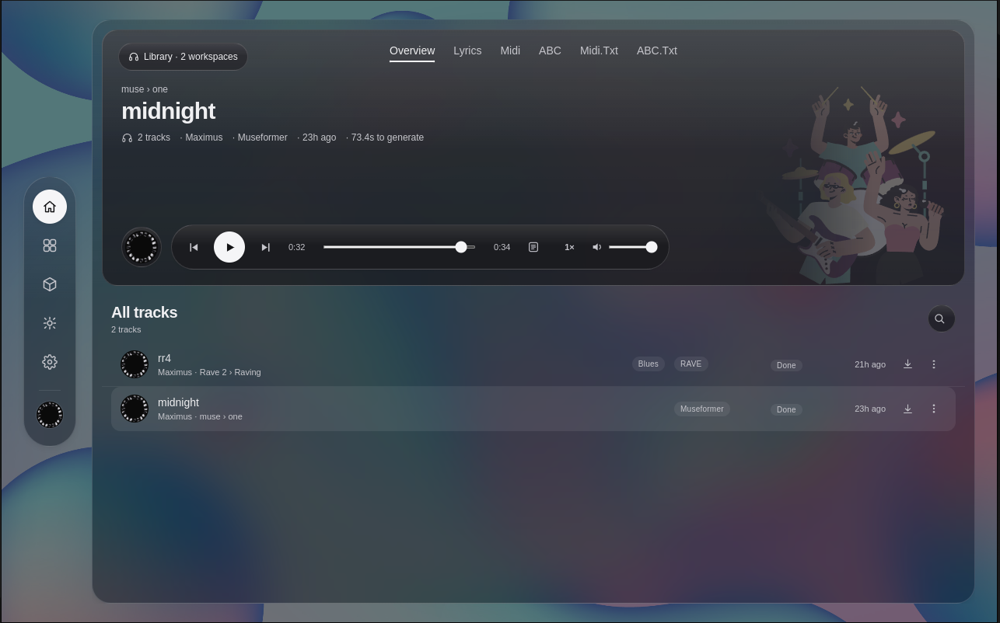
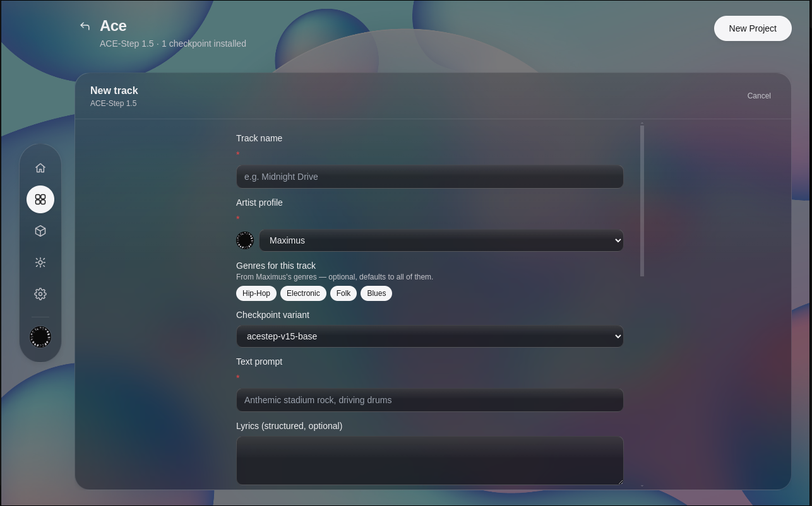
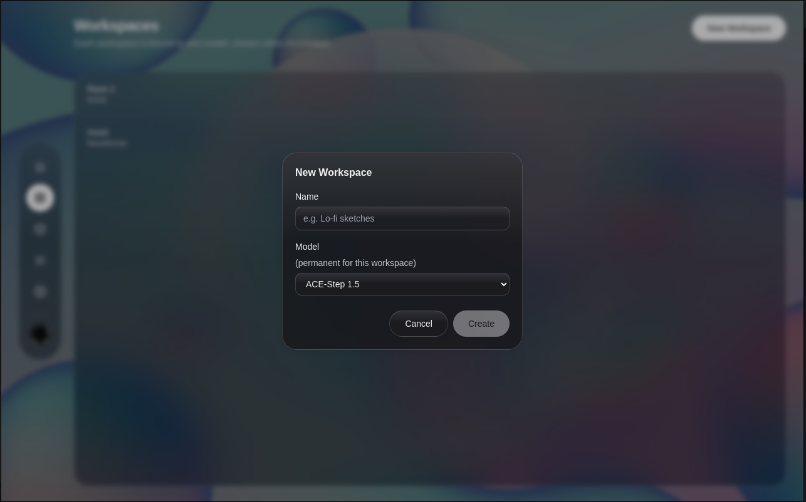
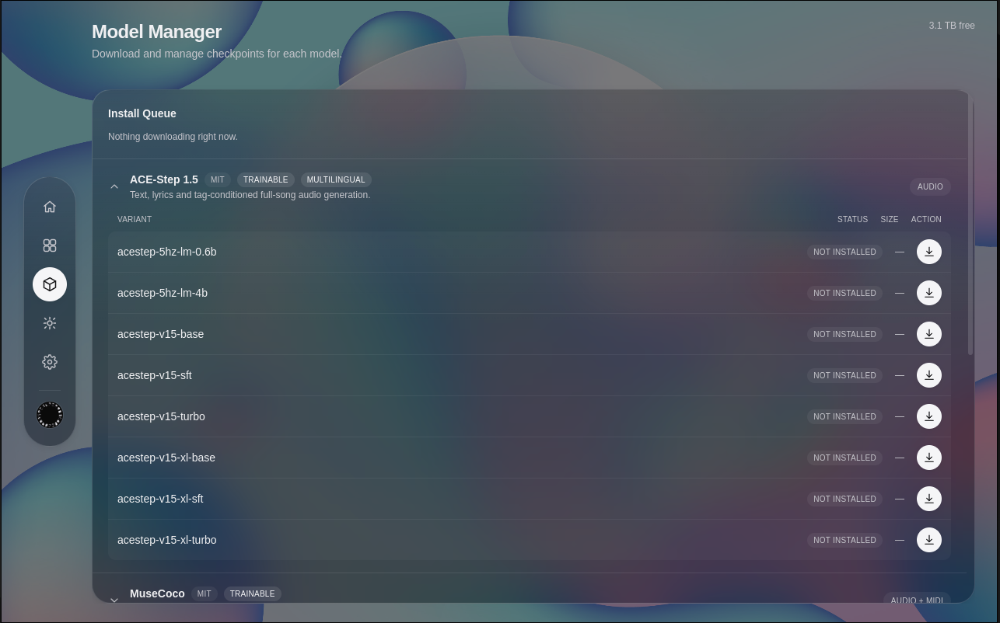
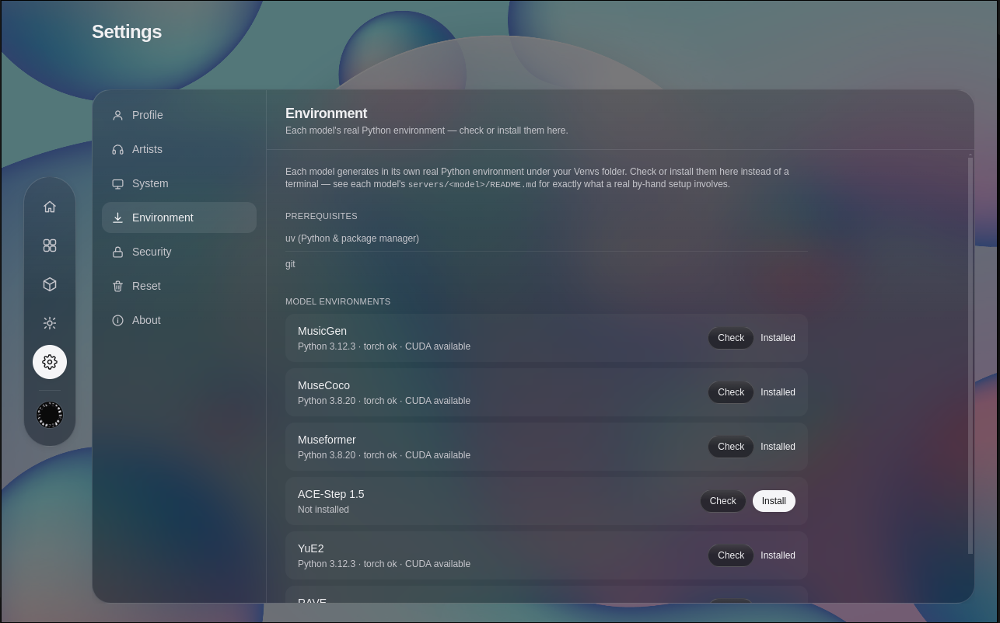
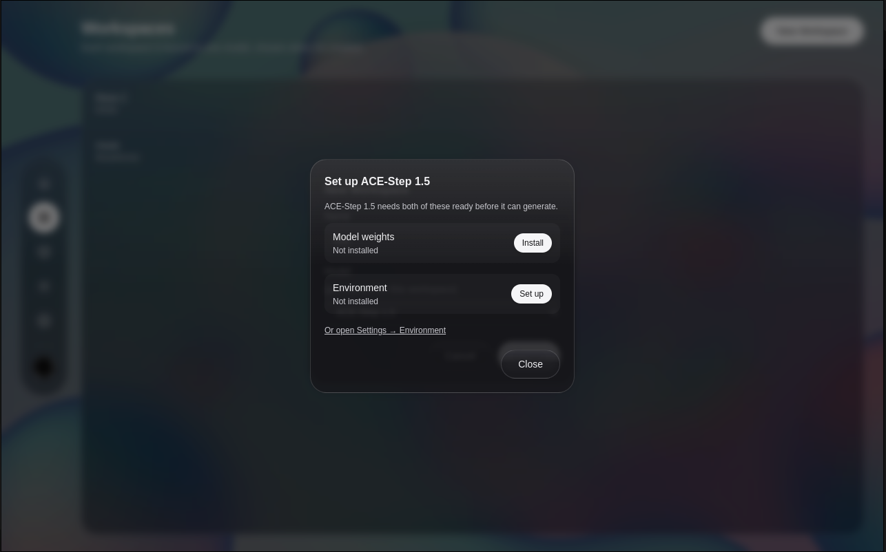
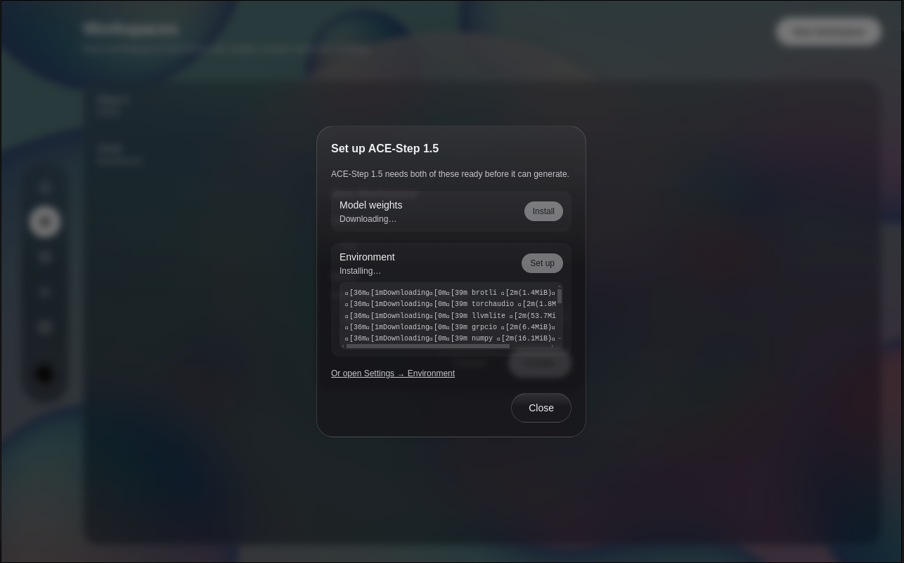
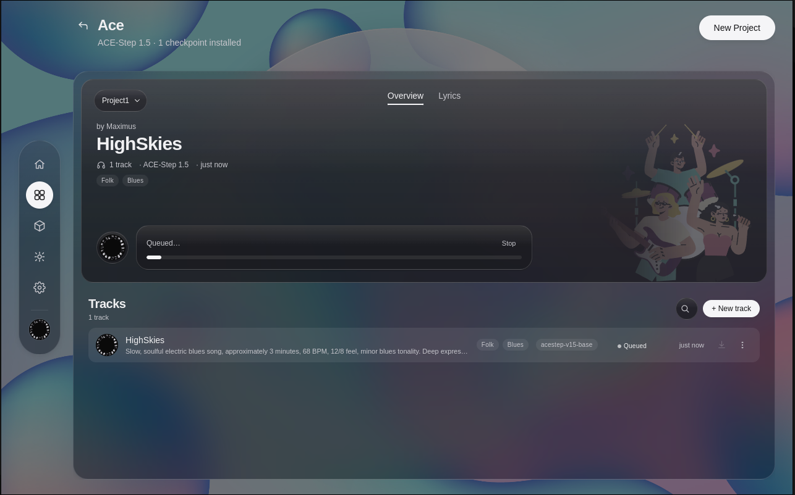
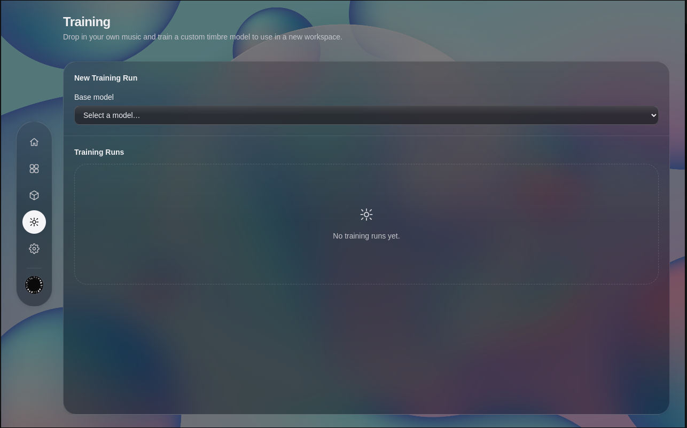

# Kwesi

<p align="center">
  
</p>

A local-first desktop app for generating and training music with open-source AI models. Everything runs on your own machine—no account, no cloud upload, no subscription.

Kwesi wraps several open-source music generation models behind one consistent interface. Pick a model, and the app reconfigures its input form and output viewer to match exactly what that model takes in and produces: text prompts, MIDI piano rolls, ABC notation, reference audio, lyrics, genre tags, or training data.

[](https://www.electronjs.org/)
[](https://react.dev/)
[](https://www.typescriptlang.org/)
[](https://vitejs.dev/)
[](https://tailwindcss.com/)
[]()

---

## Table of Contents

- [What it does](#what-it-does)
- [Demo / screenshots](#demo--screenshots)
- [Architecture](#architecture)
- [Included models](#included-models)
- [Prerequisites](#prerequisites)
- [Install](#install)
- [Model setup](#model-setup)
- [Running in development](#running-in-development)
- [Training your own checkpoints](#training-your-own-checkpoints)
- [Packaging](#packaging)
- [Configuration](#configuration)
- [Project structure](#project-structure)
- [Verified vs. config-only](#verified-vs-config-only)
- [Acknowledgments](#acknowledgments)
- [License](#license)

---

## What it does

- **Generate music locally** with text, audio, MIDI, or structured attribute inputs.
- **Browse and install models** from an in-app Model Manager.
- **Train your own checkpoints** on your own audio or MIDI for supported models.
- **Play, export, and reveal outputs** through a built-in audio transport and MIDI/notation viewers.
- **Lock the app** with a local-only passcode (optional).

Core concepts:

- **Workspace** — bound to one model family at creation time.
- **Project** — lives inside a workspace; a folder for a song/session.
- **Generation** — one output (audio, MIDI, or both) inside a project.
- **Trained model** — a checkpoint you produced, reusable like any catalog variant.

---

## Demo / screenshots

| Home / Player | New track form | Workspace setup |
|---|---|---|
|  |  |  |

| Model Manager | Settings → Environment | Setup / install model |
|---|---|---|
|  |  |  |

| Setup in progress | Generating | Training |
|---|---|---|
|  |  |  |

**What the screenshots show**

- **Home / player card** — The main playback view for a project. Switch between Overview, Lyrics, MIDI piano roll, ABC notation, and text exports.
- **New track form** — Model-specific inputs: prompt, lyrics, genre/instrument tags, checkpoint variant, and artist profile.
- **Workspace setup** — A workspace is permanently bound to one model family when it is created.
- **Model Manager** — Browse available checkpoints, see size and status, and queue downloads.
- **Settings → Environment** — Check prerequisites and install each model's isolated Python venv without touching a terminal.
- **Setup dialog** — Some models need both weights and an environment before they can generate; install them from this modal or jump to Settings.
- **Setup in progress** — Live output from `uv` as dependencies are downloaded and installed.
- **Generating** — A track queued for generation with progress and a Stop control.
- **Training** — Pick a base model, drop in your dataset, and start a local training run.

---

## Architecture

```
Electron main process
  ├── React + TypeScript renderer (Vite, Tailwind CSS)
  ├── SQLite database (better-sqlite3) for workspaces/projects/generations/settings
  └── Model Server Manager
        └── Spawns one isolated Python server per model family
              └── FastAPI/HTTP on localhost, one port per model
                    └── Loads TorchScript / fairseq / AudioCraft / ACE-Step checkpoints
```

Why one virtual environment per model? Several models in the catalog require mutually incompatible dependency versions. YuE2, for example, needs different Transformers versions across its own sub-components, and MuseCoco pins PyTorch 1.11 while ACE-Step uses a modern PyTorch. A single shared Python environment is impossible, so each model gets its own isolated venv under `KWESI_VENVS_DIR`.

Communication:

- Renderer ↔ Main: Electron IPC with a sandboxed preload script.
- Main ↔ Model server: plain HTTP + Server-Sent Events on `localhost` ports.
- Renderer ↔ Filesystem: IPC channels for audio playback, export, and reveal-in-folder (never direct Node/FS access from the renderer).

---

## Included models

| Model | What it does | Inputs | Outputs | License | Verified? |
|-------|--------------|--------|---------|---------|-----------|
| **MusicGen** (Meta AudioCraft) | Text-to-music | Text prompt; optional melody audio for `melody` variant | WAV 32 kHz | Code MIT; weights CC-BY-NC | Inference & training verified |
| **MuseCoco** (Microsoft) | Attribute-to-MIDI | Structured attributes (mood, key, tempo, genre, etc.) | MIDI | Repo MIT; verify checkpoint terms | Inference verified; training CLI wired but not completed |
| **ACE-Step 1.5** | Text/lyrics-to-audio | Prompt, lyrics in 50+ languages, BPM/key, genre/instrument tags, reference audio | WAV 48 kHz | MIT | Inference & training verified |
| **RAVE** (IRCAM/ACIDS) | Neural timbre transfer / resynthesis | Audio file (the source to transform) | WAV 44.1 kHz | CC-BY-NC-SA (code + weights) | Inference & training verified |
| **Museformer** (Microsoft) | Symbolic music continuation | Random generation or MIDI seed | MIDI | MIT | Inference verified end-to-end **on GPU**; training not wired |
| **YuE2** | Lyrics/style-to-audio + symbolic | Lyrics, style, optional reference audio | Audio + ABC/MIDI/annotations | Code Apache 2.0; weights CC-BY-NC | Standalone generation proven; **wired into app, end-to-end Electron run not yet exercised** |

**Important:** Some model weights are non-commercial or share-alike. Kwesi shows a license badge in the Model Manager and on the first-launch acknowledgments screen. You are responsible for using each model in compliance with its license.

---

## Prerequisites

To build and run Kwesi:

- **Node.js 20+** and **npm 10+**
- **Python 3.8–3.12** (different models need different Python versions; `uv` handles this)
- **`uv`** (the Python package manager) — install from [astral.sh/uv](https://astral.sh/uv)
- **Git** with LFS support if you plan to clone model checkpoints directly
- **Linux** for verified packaging; macOS and Windows builds are config-only from this repo
- A GPU is strongly recommended for most models, though RAVE and MuseCoco can run on CPU (slowly)

For end users of a packaged build, the same prerequisites apply to installing model environments from inside the app.

---

## Install

```bash
# Clone the repo
git clone https://github.com/Fobia-ai/kwesi.git
cd kwesi

# Install Node dependencies and rebuild the native SQLite module for Electron
npm install
```

Create your environment overrides if desired:

```bash
cp .env.example .env
# Edit .env to override paths (optional)
```

---

## Model setup

Before you can generate anything, you need:

1. **Model weights** in `KWESI_MODELS_DIR` (defaults to `<userData>/models`).
2. **A Python virtual environment** per model in `KWESI_VENVS_DIR`.

### Option A: Use the in-app Model Manager (recommended for end users)

1. Start the app: `npm run dev:electron`
2. Open **Model Manager** from the left rail.
3. Click **Install** on each model you want. The app will:
   - Download weights from the configured source.
   - Create and install the isolated Python venv automatically.
4. Create a workspace bound to that model, then start generating.

### Option B: Developer/manual setup

Download weights once with the developer-only script (requires a Hugging Face account only for the developer, not end users):

```bash
cd scripts
pip install -r requirements.txt
python3 download_models.py
```

Then install the per-model venvs. From inside the app, go to **Settings → Models / Environments** and click **Install** for each model. The app uses `uv` to install the pinned dependencies in `servers/<model>/requirements.txt`.

Or, manually for a single model (example: RAVE):

```bash
uv venv --python 3.12 "$KWESI_VENVS_DIR/rave"
uv pip install --python "$KWESI_VENVS_DIR/rave/bin/python" -r servers/rave/requirements.txt
```

See each `servers/<model>/README.md` for exact, model-specific instructions and known dependency caveats.

---

## Running in development

```bash
# Run the Vite dev server and Electron together
npm run dev:electron
```

Other useful scripts:

```bash
npm run dev          # Vite dev server only (browser preview, no Electron APIs)
npm run build        # Build renderer for production
npm run build:electron   # Compile Electron main + preload
npm run typecheck    # TypeScript check
npm run lint         # ESLint
npm run test         # Vitest unit tests
```

---

## Training your own checkpoints

Kwesi can fine-tune or train several models on your own material:

| Model | What you need | Output |
|-------|---------------|--------|
| **RAVE** | 3+ audio files, ~1+ minute total | A TorchScript `.ts` checkpoint usable in a new workspace |
| **MusicGen** | Audio files + text captions | A fine-tuned AudioCraft LM checkpoint |
| **ACE-Step 1.5** | Audio files + captions | A LoRA adapter (currently registered but not selectable from the generation UI) |
| **MuseCoco** | A pre-binarized fairseq data-bin directory | Continued fairseq checkpoint |

To start a training run:

1. Open the **Training** tab from the left rail.
2. Pick a supported base model and checkpoint.
3. Drop in your dataset.
4. Adjust hyperparameters (rendered from the model's manifest).
5. Choose an output folder and start the run.

Training can take hours. Kwesi writes a PID and heartbeat file per run, and will mark any run still `running` at startup as `interrupted` (true resume across app restarts is not implemented).

---

## Packaging

```bash
# Linux (AppImage + deb) — verified on this machine
npm run package:linux

# macOS (dmg) — config-only, requires macOS to build
npm run package:mac

# Windows (nsis) — config-only, requires Windows to build
npm run package:win
```

Packaged outputs land in `release/`.

**Important packaging limitation:** The Electron app shell, renderer, and SQLite layer are packaged. The per-model Python servers (`servers/<model>/`) and their venvs (`KWESI_VENVS_DIR`) are **not bundled** yet. A packaged build will launch and run every UI/DB feature, but real model inference still requires the `servers/` directory and installed venvs on disk. Bundling them is a multi-gigabyte, platform-specific follow-up.

### Auto-updater

The app is wired to check `https://github.com/Fobia-ai/kwesi/releases` on launch using `electron-updater`. **This only works once the repo is public.** Private repositories return 404 for anonymous update checks, so the app logs the failure gracefully and continues.

---

## Configuration

Every data path is controlled by an environment variable with a sensible default:

| Variable | Purpose | Default |
|----------|---------|---------|
| `KWESI_HOME` | Root data directory | OS user-data dir |
| `KWESI_DB_PATH` | SQLite file | `$KWESI_HOME/kwesi.db` |
| `KWESI_MODELS_DIR` | Downloaded model weights | `$KWESI_HOME/models` |
| `KWESI_VENVS_DIR` | Per-model Python venvs | `$KWESI_HOME/venvs` |
| `KWESI_WORKSPACES_DIR` | Workspace/project/generation files | `$KWESI_HOME/workspaces` |
| `KWESI_EXPORTS_DIR` | Default export location | OS Music folder |
| `KWESI_CACHE_DIR` | Partial downloads / temp files | `$KWESI_HOME/cache` |
| `KWESI_LOGS_DIR` | App and server logs | `$KWESI_HOME/logs` |
| `KWESI_TRAINED_MODELS_DIR` | Default training output picker location | `$KWESI_MODELS_DIR/custom` |
| `KWESI_MODEL_SERVER_PORT_RANGE` | Local ports for model servers | `17600-17999` |
| `KWESI_LOCK_IDLE_TIMEOUT_MINUTES` | Auto-lock after inactivity | `10` |

Precedence:

1. Real environment variable
2. Value persisted in Settings UI
3. Built-in default

If a value is pinned by an env var, the Settings UI shows it read-only.

---

## Project structure

```
kwesi/
├── electron/              # Electron main process, IPC, model/training managers, DB
│   ├── ipc/               # Renderer ↔ main IPC channels
│   ├── models/            # Model Server Manager, env installer, training manager
│   ├── db/                # better-sqlite3 repositories and migrations
│   └── updates/           # Auto-update logic
├── src/                   # React renderer
│   ├── components/        # UI components (generation form, audio player, MIDI viewers)
│   ├── screens/           # Top-level screens (Workspaces, Generation, Training, Settings)
│   ├── data/              # Model manifests and language/vocabulary catalogs
│   └── lib/               # State, IPC bridge, crash logging
├── servers/               # Per-model Python FastAPI servers and requirements
│   ├── musicgen/
│   ├── musecoco/
│   ├── ace-step-1.5/
│   ├── rave/
│   ├── museformer/
│   └── yue2/
├── scripts/               # Developer-only utilities (model weight downloader)
├── models/                  # Downloaded weights (gitignored)
├── venvs/                   # Installed Python venvs (gitignored)
├── kwesi.docs/              # Detailed architecture and roadmap docs
├── package.json
├── electron-builder.yml
└── .env.example
```

---

## Verified vs. config-only

This repo is honest about what has actually been built and run:

| Area | Status |
|------|--------|
| App shell + React UI + SQLite | Verified on Linux |
| MusicGen inference | Verified end-to-end |
| MuseCoco inference | Verified end-to-end (CPU) |
| ACE-Step 1.5 inference | Verified end-to-end |
| RAVE inference | Verified end-to-end |
| RAVE training | Verified end-to-end |
| MusicGen training | Verified end-to-end |
| ACE-Step 1.5 training | Verified end-to-end |
| MuseCoco training | CLI wired, run started, not completed |
| Museformer inference | Verified end-to-end **on GPU** (CPU not supported) |
| YuE2 inference | Standalone proven; wired into app, full Electron end-to-end not yet exercised (weights not present on this machine) |
| Linux packaging (AppImage + deb) | Built and verified |
| macOS packaging | Config-only |
| Windows packaging | Config-only |
| Auto-updater | Wired; only works after repo is public |
| Bundled Python servers/venvs in installer | Not implemented |

---

## Acknowledgments

Kwesi stands on the work of many open-source research projects:

- **ACE-Step 1.5** — ACE-Step team
- **YuE2 / YuE** — Multimodal Art Projection (M-A-P)
- **MusicGen / AudioCraft** — Meta AI
- **MuseCoco / Museformer** — Microsoft Muzic team
- **RAVE** — IRCAM / ACIDS

The first-launch acknowledgments screen in the app shows the exact license for each. We are grateful to the researchers and maintainers who released these models.

---

## License

Kwesi's own application code and original documentation are licensed under the
**Creative Commons Attribution-NonCommercial 4.0 International License**
(CC BY-NC 4.0). See [`LICENSES/LICENSE-Kwesi.md`](LICENSES/LICENSE-Kwesi.md).

Bundled open-source models remain under their own licenses. See
[`LICENSES/`](LICENSES/) for the full list. Important notes:

- Some model **weights** are non-commercial (MusicGen, YuE2, RAVE).
- Some model **code** is permissively licensed (MIT, Apache 2.0).
- Generated music/audio may be subject to the model's own license and to
  third-party rights.

You must comply with every bundled model's license in addition to the Kwesi
license.

---

## Questions / issues

Open a GitHub issue or discussion. Since this is a local-first app, please include:

- OS and version
- Node/npm version
- GPU and driver version (for generation issues)
- Relevant logs from `KWESI_LOGS_DIR/crashes.log` and `KWESI_LOGS_DIR/`
