# Kwesi

<p align="center">
  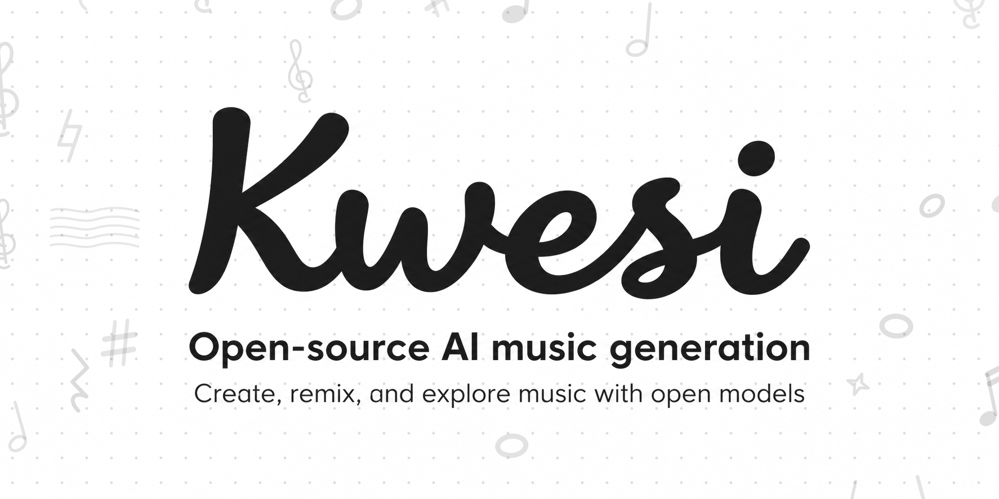
</p>

A local-first desktop app for generating and training music with open-source AI models. Everything runs on your own machine—no account, no cloud upload, no subscription.

Kwesi wraps several open-source music generation models behind one consistent interface. Pick a model, and the app reconfigures its input form and output viewer to match exactly what that model takes in and produces: text prompts, MIDI piano rolls, ABC notation, reference audio, lyrics, genre tags, or training data.

[](https://www.electronjs.org/)
[](https://react.dev/)
[](https://www.typescriptlang.org/)
[](https://vitejs.dev/)
[](https://tailwindcss.com/)
[]()

---

## Table of Contents

- [What it does](#what-it-does)
- [Demo / screenshots](#demo--screenshots)
- [Architecture](#architecture)
- [Included models](#included-models)
- [Prerequisites](#prerequisites)
- [Install](#install)
- [Model setup](#model-setup)
- [Running in development](#running-in-development)
- [Training your own checkpoints](#training-your-own-checkpoints)
- [Packaging](#packaging)
- [Configuration](#configuration)
- [Project structure](#project-structure)
- [Verified vs. config-only](#verified-vs-config-only)
- [Acknowledgments](#acknowledgments)
- [License](#license)

---

## What it does

- **Generate music locally** with text, audio, MIDI, or structured attribute inputs.
- **Browse and install models** from an in-app Model Manager.
- **Train your own checkpoints** on your own audio or MIDI for supported models — with dataset checks, presets, time and disk estimates, a preview clip at the end, and the option to keep training a model you already made.
- **Play, export, and reveal outputs** through a built-in audio transport and MIDI/notation viewers.
- **Lock the app** with a local-only passcode (optional).

Core concepts:

- **Workspace** — bound to one model family at creation time.
- **Project** — lives inside a workspace; a folder for a song/session.
- **Generation** — one output (audio, MIDI, or both) inside a project.
- **Trained model** — a checkpoint you produced, listed under "Your trained models" in any workspace of the same model, and manageable (preview, open folder, delete) from Model Manager.

---

## Demo / screenshots

| Welcome | Home / Player | MIDI piano roll |
|---|---|---|
| 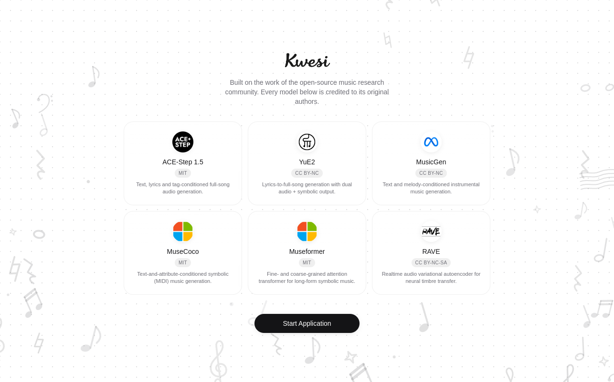 | 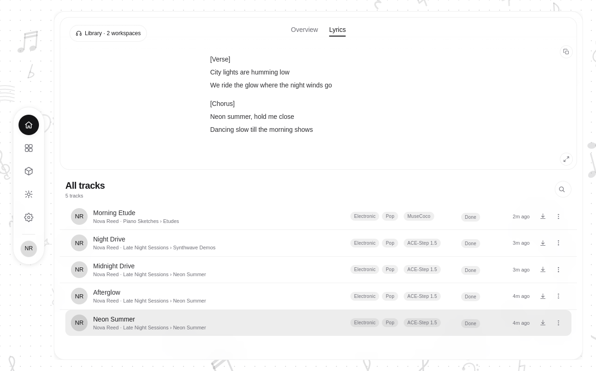 | 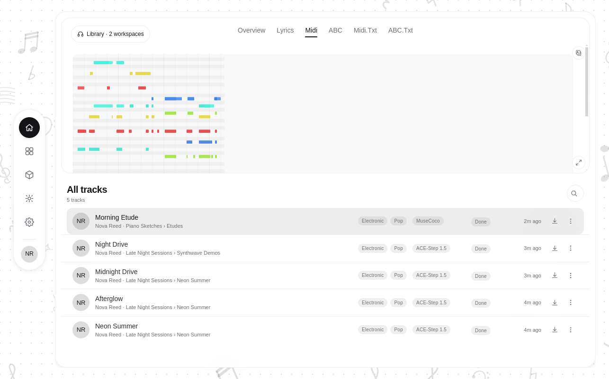 |

| ABC notation | Workspace setup | New track form |
|---|---|---|
| 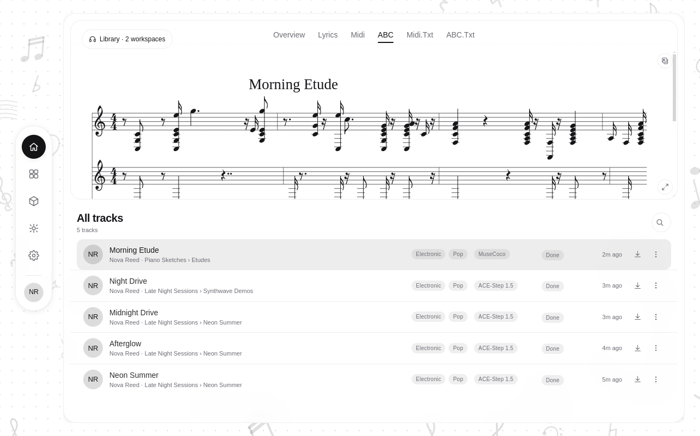 | 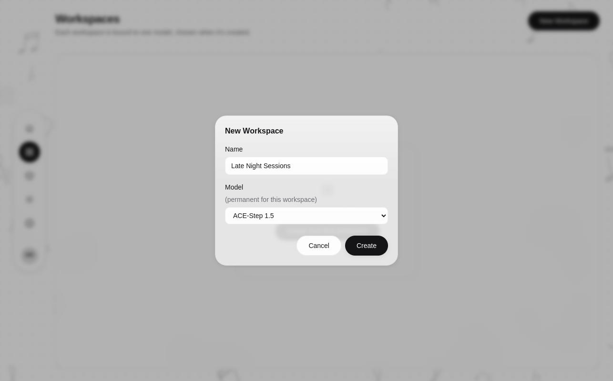 | 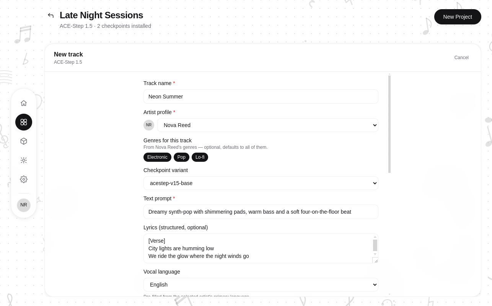 |

| Generating | Model Manager | My trained models |
|---|---|---|
| 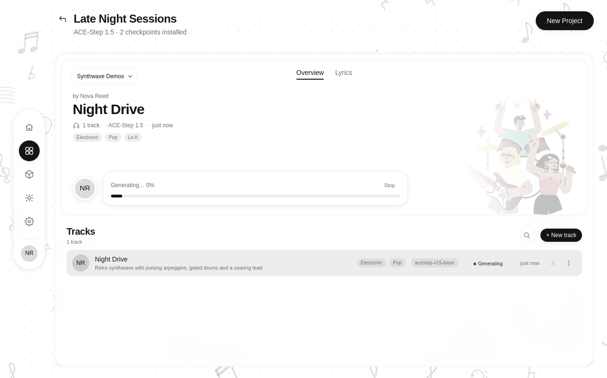 | 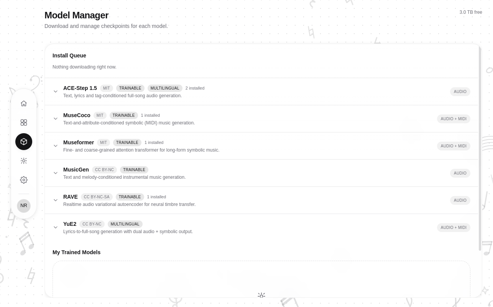 | 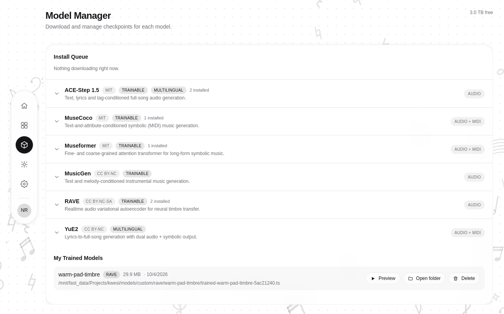 |

| Settings → Environment | Setup dialog | Training |
|---|---|---|
| 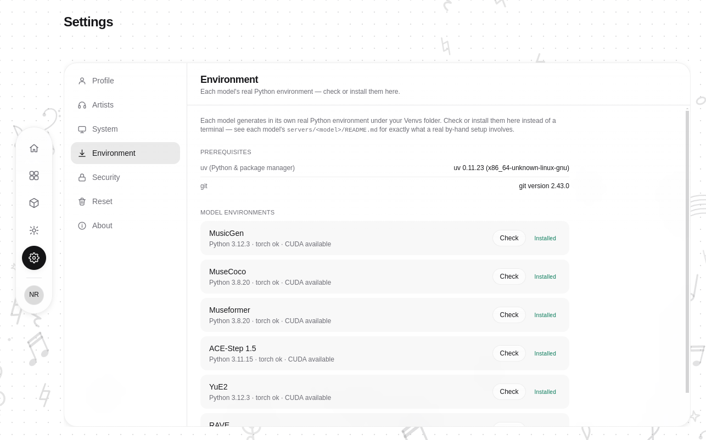 | 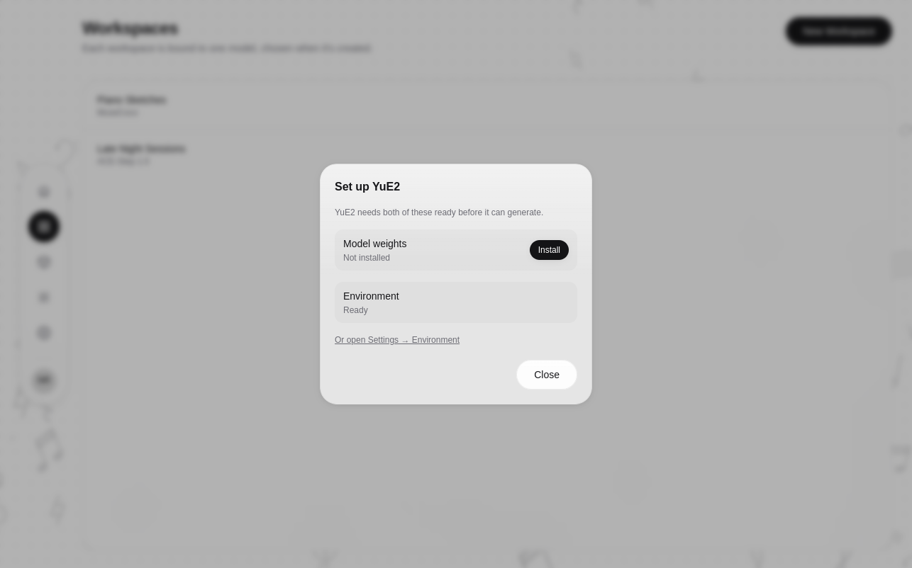 | 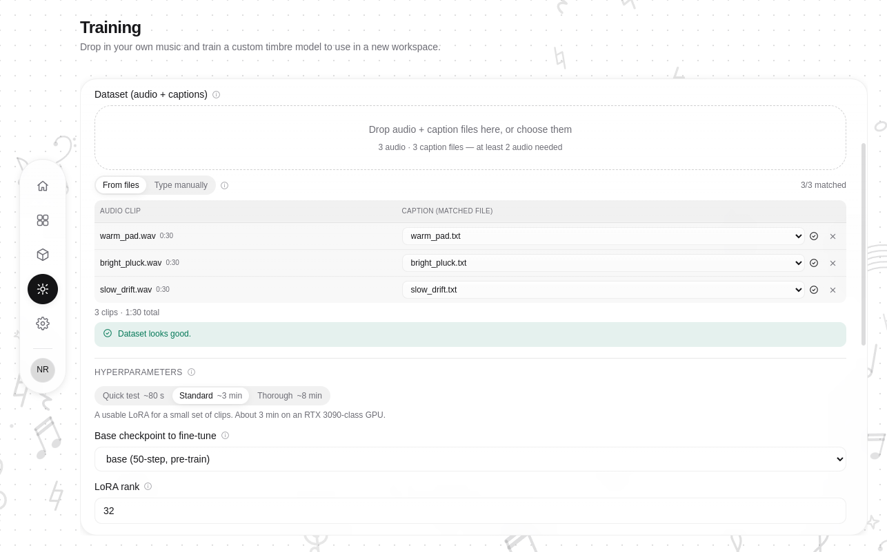 |

| Training MuseCoco from MIDI | Continue training |
|---|---|
| 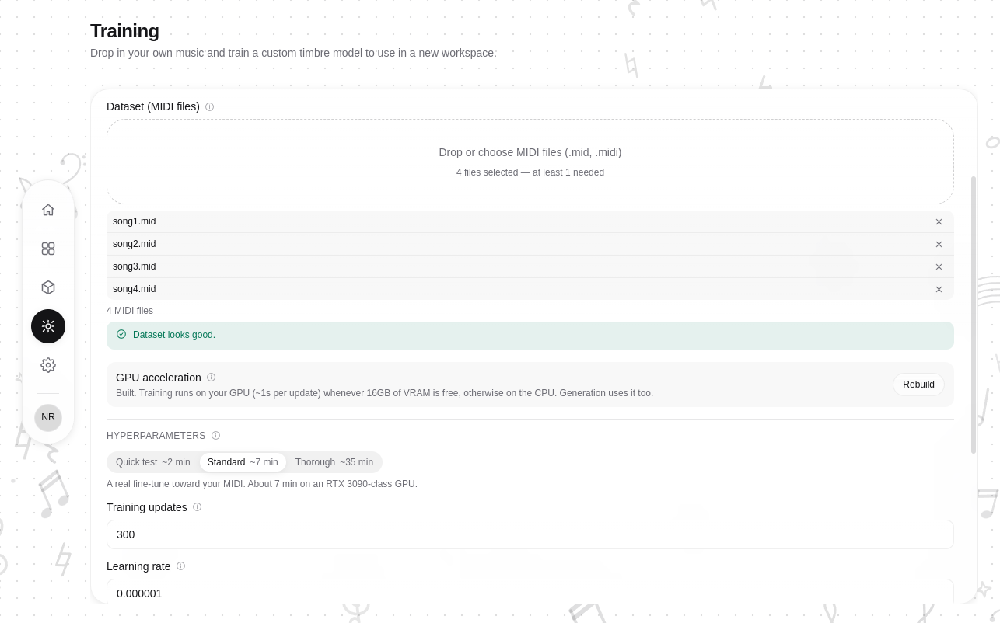 | 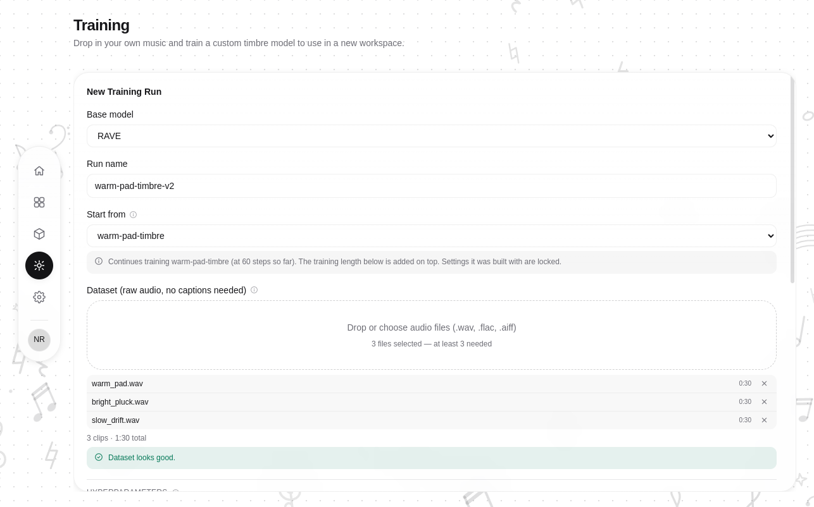 |

**What the screenshots show**

- **Welcome** — The first-launch screen, which credits each model to its authors with its licence. The whole app sits on a white dotted grid framed by music doodles.
- **Home / player card** — The main playback view for a project. Switch between Overview, Lyrics, MIDI piano roll, ABC notation, and text exports.
- **MIDI piano roll / ABC notation** — Symbolic models (MuseCoco, Museformer, YuE2) show their notes as a piano roll and as engraved staff notation, next to the rendered audio.
- **Workspace setup** — A workspace is permanently bound to one model family when it is created.
- **New track form** — Model-specific inputs: prompt, lyrics, genre/instrument tags, checkpoint variant, and artist profile.
- **Generating** — Tracks queued and generating, with progress and a Stop control.
- **Model Manager** — Browse available checkpoints, see size and status, and queue downloads. Models you train are listed under My Trained Models, where you can preview, open or delete each one.
- **Settings → Environment** — Check prerequisites and install each model's isolated Python venv without touching a terminal.
- **Setup dialog** — If a model is missing its weights or environment, this dialog lets you install them before you create a workspace or generate.
- **Training** — Pick a base model, drop in your dataset, and choose a preset. The form checks the dataset and free disk space and shows a time estimate before you start.
- **Training MuseCoco from MIDI** — Train on your own MIDI files, with optional GPU acceleration built from the same screen.
- **Continue training** — Start a new run from a model you trained before. Settings that must match the original are locked.

---

## Architecture

```
Electron main process
  ├── React + TypeScript renderer (Vite, Tailwind CSS)
  ├── SQLite database (better-sqlite3) for workspaces/projects/generations/settings
  └── Model Server Manager
        └── Spawns one isolated Python server per model family
              └── FastAPI/HTTP on localhost, one port per model
                    └── Loads TorchScript / fairseq / AudioCraft / ACE-Step checkpoints
```

Why one virtual environment per model? Several models in the catalog require mutually incompatible dependency versions. YuE2, for example, needs different Transformers versions across its own sub-components, and MuseCoco pins PyTorch 1.11 while ACE-Step uses a modern PyTorch. A single shared Python environment is impossible, so each model gets its own isolated venv under `KWESI_VENVS_DIR`.

Communication:

- Renderer ↔ Main: Electron IPC with a sandboxed preload script.
- Main ↔ Model server: plain HTTP + Server-Sent Events on `localhost` ports.
- Renderer ↔ Filesystem: IPC channels for audio playback, export, and reveal-in-folder (never direct Node/FS access from the renderer).

---

## Included models

| Model | What it does | Inputs | Outputs | License | Verified? |
|-------|--------------|--------|---------|---------|-----------|
| **MusicGen** (Meta AudioCraft) | Text-to-music | Text prompt; optional melody audio for `melody` variant | WAV 32 kHz | Code MIT; weights CC-BY-NC | Inference & training verified |
| **MuseCoco** (Microsoft) | Attribute-to-MIDI | Structured attributes (mood, key, tempo, genre, etc.) | MIDI, plus a rendered WAV | Repo MIT; verify checkpoint terms | Inference & training verified (CPU, or GPU after building GPU acceleration) |
| **ACE-Step 1.5** | Text/lyrics-to-audio | Prompt, lyrics in 50+ languages, BPM/key, genre/instrument tags, reference audio | WAV 48 kHz | MIT | Inference & training verified |
| **RAVE** (IRCAM/ACIDS) | Neural timbre transfer / resynthesis | Audio file (the source to transform) | WAV 44.1 kHz | CC-BY-NC-SA (code + weights) | Inference & training verified |
| **Museformer** (Microsoft) | Symbolic music continuation | Random generation or MIDI seed | MIDI | MIT | Inference verified end-to-end **on GPU**; training not wired |
| **YuE2** | Lyrics/style-to-audio + symbolic | Lyrics, style, optional reference audio | Audio + ABC/MIDI/annotations | Code Apache 2.0; weights CC-BY-NC | Standalone generation proven; **wired into app, end-to-end Electron run not yet exercised** |

**Important:** Some model weights are non-commercial or share-alike. Kwesi shows a license badge in the Model Manager and on the first-launch acknowledgments screen. You are responsible for using each model in compliance with its license.

---

## Prerequisites

To build and run Kwesi:

- **Node.js 20+** and **npm 10+**
- **Python 3.8–3.12** (different models need different Python versions; `uv` handles this)
- **`uv`** (the Python package manager) — install from [astral.sh/uv](https://astral.sh/uv)
- **Git** with LFS support if you plan to clone model checkpoints directly
- **Linux** for verified packaging; macOS and Windows builds are config-only from this repo
- A GPU is strongly recommended for most models, though RAVE and MuseCoco can run on CPU (slowly)
- **Optional, Linux + NVIDIA only:** MuseCoco's GPU acceleration is built from the Training screen. The app downloads its own pinned build toolchain for it (no system CUDA install needed), and deletes it afterwards.

For end users of a packaged build, the same prerequisites apply to installing model environments from inside the app.

---

## Install

```bash
# Clone the repo
git clone https://github.com/Fobia-ai/kwesi.git
cd kwesi

# Install Node dependencies and rebuild the native SQLite module for Electron
npm install
```

Create your environment overrides if desired:

```bash
cp .env.example .env
# Edit .env to override paths (optional)
```

---

## Model setup

Before you can generate anything, you need:

1. **Model weights** in `KWESI_MODELS_DIR` (defaults to `<userData>/models`).
2. **A Python virtual environment** per model in `KWESI_VENVS_DIR`.

### Option A: Use the in-app Model Manager (recommended for end users)

1. Start the app: `npm run dev:electron`
2. Open **Model Manager** from the left rail.
3. Click **Install** on each model you want. The app will:
   - Download weights from the configured source.
   - Create and install the isolated Python venv automatically.
4. Create a workspace bound to that model, then start generating.

### Option B: Developer/manual setup

Download weights once with the developer-only script (requires a Hugging Face account only for the developer, not end users):

```bash
cd scripts
pip install -r requirements.txt
python3 download_models.py
```

Then install the per-model venvs. From inside the app, go to **Settings → Environment** and click **Install** for each model. The app uses `uv` to install the pinned dependencies in `servers/<model>/requirements.txt`.

Or, manually for a single model (example: RAVE):

```bash
uv venv --python 3.12 "$KWESI_VENVS_DIR/rave"
uv pip install --python "$KWESI_VENVS_DIR/rave/bin/python" -r servers/rave/requirements.txt
```

See each `servers/<model>/README.md` for exact, model-specific instructions and known dependency caveats.

---

## Running in development

```bash
# Run the Vite dev server and Electron together
npm run dev:electron
```

Other useful scripts:

```bash
npm run dev          # Vite dev server only (browser preview, no Electron APIs)
npm run build        # Build renderer for production
npm run build:electron   # Compile Electron main + preload
npm run typecheck    # TypeScript check
npm run lint         # ESLint
npm run test         # Vitest unit tests
```

---

## Training your own checkpoints

Kwesi can fine-tune or train four models on your own material, all from the **Training** tab:

| Model | What you need | What you get |
|-------|---------------|--------------|
| **RAVE** | 3+ audio files, 1+ minute total | A TorchScript `.ts` timbre model (trained from scratch) |
| **MusicGen** | 2+ audio clips with captions (30 s+ each works best) | A fine-tuned MusicGen checkpoint |
| **ACE-Step 1.5** | 2+ audio clips with captions | A LoRA adapter, applied on top of the base it was trained on |
| **MuseCoco** | 1+ MIDI files | A fine-tuned MuseCoco checkpoint |

Every finished model shows up under **Your trained models** in the checkpoint picker of any workspace that uses the same model, and in **Model Manager → My Trained Models**.

### Starting a run

1. Open the **Training** tab and pick a model.
2. Optionally pick **Start from** one of your own models to keep training it instead of the stock base.
3. Drop in your dataset. For captioned models, caption files (`.txt`, `.lrc`, `.srt`, `.vtt`) pair up with clips of the same name, or you can type captions in.
4. Pick a preset — **Quick test**, **Standard** or **Thorough** — or adjust the settings yourself. Every setting has an ⓘ explaining it.
5. Choose where to save it and start the run.

### What the form checks before you start

- **Dataset** — each clip's length is shown. Too few files, too little audio, and empty or unreadable files block the run; clips that are too short or too long for the model, and duplicate names, show a warning.
- **Time** — each preset shows an estimated duration, measured on an RTX 3090 (for example, RAVE's Standard preset: ~9 min estimated, 7.5 min measured).
- **Disk space** — how much the run needs for temporary files and for the finished model, against what's free. A run that won't fit can't start.
- **Your rights** — before your first run, Kwesi asks you to confirm that you own or have the rights to everything you train on, and that you're responsible for it. It asks once.
- **Setup** — the model's training environment, and any base weights the run fine-tunes from, must be installed; a dialog offers to install them.

### During and after a run

- Live progress for each phase (preparing the dataset, training, exporting, making the preview) and the full log.
- Idle model servers are stopped first, so the run gets the GPU memory.
- When it finishes, the app generates a **short preview clip** with the new model, playable from the run and from Model Manager.
- Temporary files are cleaned up; only the run's log is kept.
- From **Model Manager → My Trained Models** you can preview, open the folder, or **delete** a trained model and everything it saved.

### Continuing a trained model

Choosing one of your models under **Start from** keeps training it on new clips. Settings it was built with (MusicGen's size, ACE-Step's base and LoRA shape, RAVE's config) are locked, and the training length you pick is added on top. RAVE models keep a small training checkpoint (`<model>.resume/`, ~120 MB) for this.

### Model-specific notes

- **MuseCoco** reads instruments, tempo, key, time signature and more straight from your MIDI files, so no labels are needed. It trains on the CPU (~50 s per update) unless you build **GPU acceleration** from its card on the Training screen (Linux + NVIDIA, about 5 minutes once); after that it trains at ~1 s per update and generates in seconds instead of minutes. See [`servers/musecoco/README.md`](servers/musecoco/README.md).
- **ACE-Step** trained adapters get a **LoRA strength** control (0–1) in the generation form.
- A run that was still going when the app closed is marked **interrupted** on the next launch; resuming a half-finished run isn't supported (start a new one, or continue from a finished model).

---

## Packaging

```bash
# Linux (AppImage + deb) — verified on this machine
npm run package:linux

# macOS (dmg + zip, for Intel and Apple silicon) — requires macOS to build; CI builds it on every release
npm run package:mac

# Windows (nsis) — config-only, requires Windows to build
npm run package:win
```

Packaged outputs land in `release/`.

**What a packaged build contains:** the app itself plus each model's small server source (`servers/<model>/`). The multi-gigabyte parts — each model's Python environment, its upstream code, and its weights — are downloaded and installed from inside the app (Model Manager and Settings → Environment), not bundled.

### Auto-updater

Installed copies of Kwesi update themselves from this repo's [GitHub Releases](https://github.com/Fobia-ai/kwesi/releases) using `electron-updater`:

- Kwesi checks for a new release when it starts (and every few hours while it stays open). The only server it talks to is GitHub: this repo's `releases.atom` feed, then the release's `latest-*.yml`. Nothing downloads until you ask.
- When a newer version exists, a small download icon with the version appears at the bottom of the left rail. It opens **Settings → About**, which shows your current version and a **Check for updates** button. Once a newer version is found there, you get **Download**, a progress bar, and then **Restart to update**. A downloaded update also installs the next time you quit.
- It works for the AppImage and `.deb` on Linux, the installed app on Windows, and a signed app on macOS. Running from source never checks.
- **Turning it off:** use the **Automatic updates** On / Off switch in Settings → About. It takes effect immediately and is remembered. When it's off, Kwesi makes no update requests at all. For scripted or managed setups there's also the `KWESI_AUTO_UPDATE` env var (`false` / `0` / `no` / `off`), but the Settings switch overrides it once someone uses it. Updates are on by default. Copies installed by the Fobia launcher (`KWESI_MANAGED_PACKAGE=1`) never self-update; the launcher handles that.

**Cutting a release:** bump `version` in `package.json`, commit, then tag and push `vX.Y.Z` (it must match `package.json`, or the workflow fails). `.github/workflows/release.yml` builds Linux, macOS and Windows, uploads the installers plus the `latest*.yml` and `.blockmap` files the updater reads, and **publishes** the release. A draft is invisible to the updater, so a release only reaches installed copies once it's published. Details: [kwesi.docs/02-architecture.md](kwesi.docs/02-architecture.md#auto-update).

---

## Configuration

Every data path is controlled by an environment variable with a sensible default:

| Variable | Purpose | Default |
|----------|---------|---------|
| `KWESI_HOME` | Root data directory | OS user-data dir |
| `KWESI_DB_PATH` | SQLite file | `$KWESI_HOME/kwesi.db` |
| `KWESI_MODELS_DIR` | Downloaded model weights | `$KWESI_HOME/models` |
| `KWESI_VENVS_DIR` | Per-model Python venvs | `$KWESI_HOME/venvs` |
| `KWESI_WORKSPACES_DIR` | Workspace/project/generation files | `$KWESI_HOME/workspaces` |
| `KWESI_EXPORTS_DIR` | Default export location | OS Music folder |
| `KWESI_CACHE_DIR` | Partial downloads / temp files | `$KWESI_HOME/cache` |
| `KWESI_LOGS_DIR` | App and server logs | `$KWESI_HOME/logs` |
| `KWESI_TRAINED_MODELS_DIR` | Default training output picker location | `$KWESI_MODELS_DIR/custom` |
| `KWESI_MODEL_SERVER_PORT_RANGE` | Local ports for model servers | `17600-17999` |
| `KWESI_LOCK_IDLE_TIMEOUT_MINUTES` | Auto-lock after inactivity | `10` |
| `KWESI_AUTO_UPDATE` | Check GitHub Releases for app updates (`false` turns it off). The Settings → About switch overrides it once used | `true` |

Precedence:

1. Real environment variable
2. Value persisted in Settings UI
3. Built-in default

If a value is pinned by an env var, the Settings UI shows it read-only.

---

## Project structure

```
kwesi/
├── electron/              # Electron main process, IPC, model/training managers, DB
│   ├── ipc/               # Renderer ↔ main IPC channels
│   ├── models/            # Model Server Manager, env installer, training manager
│   ├── db/                # better-sqlite3 repositories and migrations
│   └── updates/           # Auto-update logic
├── src/                   # React renderer
│   ├── components/        # UI components (generation form, audio player, MIDI viewers)
│   ├── screens/           # Top-level screens (Workspaces, Generation, Training, Settings)
│   ├── data/              # Model manifests and language/vocabulary catalogs
│   └── lib/               # State, IPC bridge, crash logging
├── servers/               # Per-model Python FastAPI servers and requirements
│   ├── musicgen/
│   ├── musecoco/
│   ├── ace-step-1.5/
│   ├── rave/
│   ├── museformer/
│   └── yue2/
├── scripts/               # Developer-only utilities (model weight downloader)
├── models/                  # Downloaded weights (gitignored)
├── venvs/                   # Installed Python venvs (gitignored)
├── kwesi.docs/              # Detailed architecture and roadmap docs
├── package.json
├── electron-builder.yml
└── .env.example
```

---

## Verified vs. config-only

This repo is honest about what has actually been built and run:

| Area | Status |
|------|--------|
| App shell + React UI + SQLite | Verified on Linux |
| MusicGen inference | Verified end-to-end |
| MuseCoco inference | Verified end-to-end (CPU, and GPU with GPU acceleration built) |
| ACE-Step 1.5 inference | Verified end-to-end |
| RAVE inference | Verified end-to-end |
| RAVE training | Verified end-to-end |
| MusicGen training | Verified end-to-end |
| ACE-Step 1.5 training | Verified end-to-end |
| MuseCoco training | Verified end-to-end from MIDI files (CPU and GPU) |
| Training extras: presets, dataset/disk checks, previews, continue training, delete | Verified in the app for all four trainable models |
| MuseCoco GPU acceleration build | Verified on Linux + NVIDIA (RTX 3090) |
| Museformer inference | Verified end-to-end **on GPU** (CPU not supported) |
| YuE2 inference | Standalone proven; wired into app, full Electron end-to-end not yet exercised (weights not present on this machine) |
| Linux packaging (AppImage + deb) | Built and verified |
| macOS packaging | Config-only |
| Windows packaging | Config-only |
| Auto-updater | Check → download → restart verified end to end on a Linux AppImage (local feed); live GitHub check and the Settings on/off switch verified. macOS/Windows update paths config-only |
| Model environments in installer | Installed from inside the app instead (server source is bundled) |

---

## Acknowledgments

Kwesi stands on the work of many open-source research projects:

- **ACE-Step 1.5** — ACE-Step team
- **YuE2 / YuE** — Multimodal Art Projection (M-A-P)
- **MusicGen / AudioCraft** — Meta AI
- **MuseCoco / Museformer** — Microsoft Muzic team
- **RAVE** — IRCAM / ACIDS

The first-launch acknowledgments screen in the app shows the exact license for each. We are grateful to the researchers and maintainers who released these models.

---

## License

Kwesi's own application code and original documentation are licensed under the
**Creative Commons Attribution-NonCommercial 4.0 International License**
(CC BY-NC 4.0). See [`LICENSES/LICENSE-Kwesi.md`](LICENSES/LICENSE-Kwesi.md).

**What you make is yours.** Fobia grants an additional permission alongside
CC BY-NC 4.0. The music, MIDI, notation and trained models you create with
Kwesi are yours, and Fobia places no restriction of its own on how you use
them, including commercially (for example, monetized videos or client work).
The non-commercial term applies to Kwesi itself, not to your work. Each
model's own license still applies. For commercial work, use a model that
allows it, such as ACE-Step 1.5 (MIT).

Bundled open-source models remain under their own licenses. See
[`LICENSES/`](LICENSES/) for the full list. Important notes:

- Some model **weights** are non-commercial (MusicGen, YuE2, RAVE).
- Some model **code** is permissively licensed (MIT, Apache 2.0).
- Generated music/audio may be subject to the model's own license and to
  third-party rights.

You must comply with every bundled model's license in addition to the Kwesi
license.

---

## Questions / issues

Open a GitHub issue or discussion. Since this is a local-first app, please include:

- OS and version
- Node/npm version
- GPU and driver version (for generation issues)
- Relevant logs from `KWESI_LOGS_DIR/crashes.log` and `KWESI_LOGS_DIR/`
